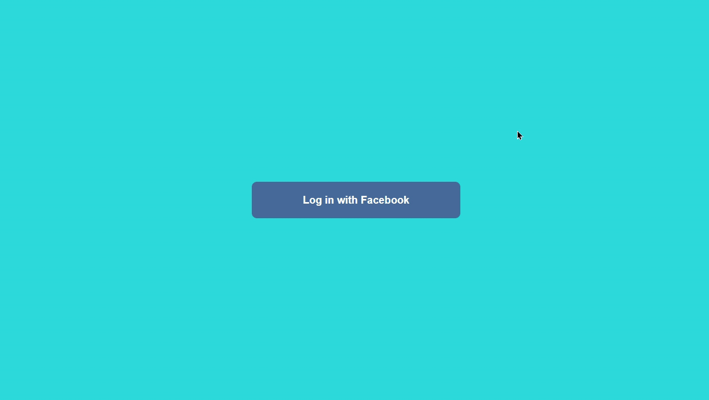

# Whatsapp Web Clone with React.JS
> clone of whatsapp web with react.js

## Technology stack

* **Front-end:** [React.Js](https://reactjs.org/)
* **Back-End:** [Firebase](https://firebase.google.com/)

## Running locally

### Installation
`npm install`

### To run the project
`npm run dev -- --https`

© Marcos Andre